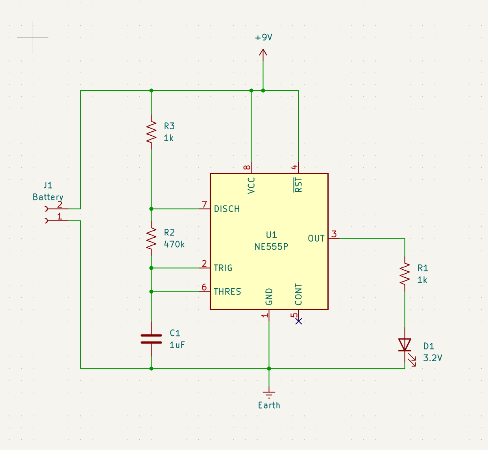
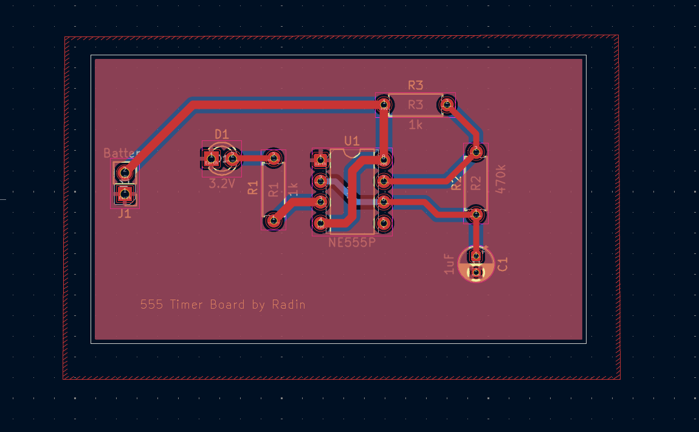
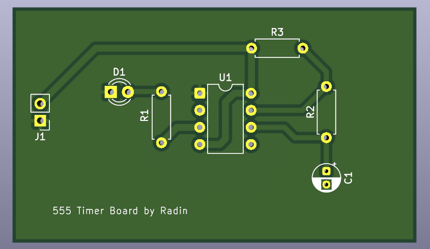

# 555 Timer Astable PCB

## Overview
This PCB is a simple **555 timer** circuit configured in **astable mode**, designed to blink an LED. It is powered by a 9V battery and includes a single LED with a current-limiting resistor. The control voltage (CV) pin is disconnected.  

Key features:  

- Uses **NE555 or equivalent** timer IC  
- Astable configuration for continuous oscillation  
- Battery-powered (9V)  
- LED indicator with current-limiting resistor  
- LTSpice simulation file included for testing and verification  

---

## Components
- **Timer IC:** 555 timer (NE555)  
- **Capacitor:** 1µF between TRIG/THRES and GND  
- **Resistors:**  
  - R1 = 1kΩ series resistor with LED 
  - R2 = 470kΩ between DISCH and TRIG/THRES  
  - R3 = 1kΩ between DISCH and VCC node (also RESET tied to VCC)
- **LED:** Indicator for output  
- **Power supply:** 9V battery  

---

## Wiring & Connections
| Pin | Connection |
|-----|-----------|
| VCC | Positive battery terminal (+9V) |
| GND | Negative battery terminal |
| DISCH | Connected through R3 (1kΩ) to VCC node |
| TRIG | Connected to R2 (470kΩ) from DISCH and 1µF capacitor to GND |
| THRES | Connected to TRIG and 1µF capacitor to GND |
| OUT | LED in series with R1 (1kΩ) to GND |
| RESET | Tied to VCC node (battery positive) |
| CV | Disconnected |

> The LED includes a built-in 1kΩ current-limiting resistor.  
> **Note:** The battery connector is where you connect the 9V battery; observe LED polarity.

---

## Usage
1. Connect a 9V battery to the PCB.  
2. The 555 timer begins oscillating in astable mode.  
3. The LED will blink according to the calculated frequency.  
4. You can simulate the circuit using the included LTSpice file to verify timing and LED behavior.  

---

## Calculations

For a 555 timer in astable mode:

```
T_high = 0.693 * (R2 + R3) * C
T_low  = 0.693 * R2 * C
T_total = T_high + T_low = 0.693 * (R3 + 2*R2) * C
f = 1 / T_total
Duty cycle = T_high / T_total
```

**Using component values:**  

- R2 = 470kΩ  
- R3 = 1kΩ  
- C = 1µF  

**Step 1: Total period**  

```
T_total = 0.693 * (R3 + 2*R2) * C
T_total = 0.693 * (1,000 + 2*470,000) * 0.000001
T_total ≈ 0.651 seconds
```

**Step 2: Frequency**  

```
f = 1 / T_total ≈ 1 / 0.651 ≈ 1.54 Hz
```

**Step 3: Duty cycle**  

```
T_high = 0.693 * (R2 + R3) * C
T_high = 0.693 * (470,000 + 1,000) * 0.000001 ≈ 0.326 s
Duty cycle ≈ T_high / T_total ≈ 0.326 / 0.651 ≈ 50%
```

> R1 (LED resistor) does not affect timing.

---

## Simulation
- You can simulate the circuit using the included **LTSpice file**.  
- The OUT pin waveform will correspond to the LED blink pattern.  
- Adjust R2, R3, or C to change the frequency and duty cycle as needed.  

---

## Images

### Schematic


### PCB Layout


### 3D PCB Render
